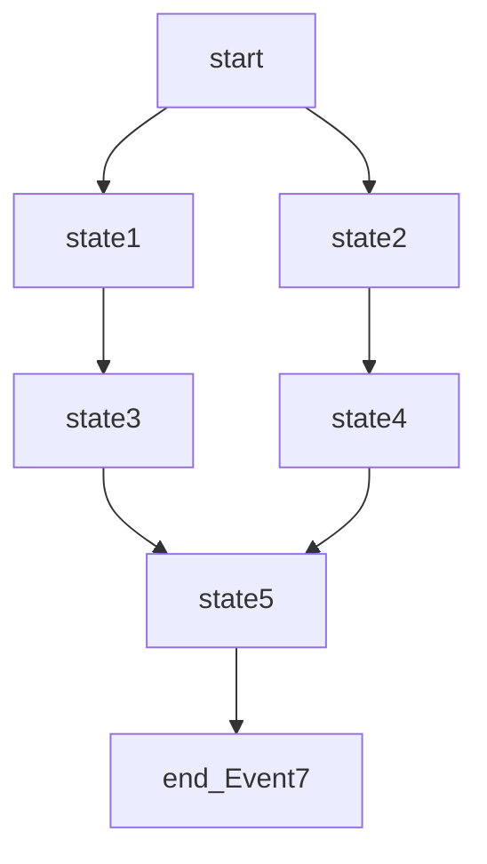

🧬 ** Код сансары, структура дхармы, ООП кармы **.

Обучающая концепция для привыкания к разработке программ, используя диаграммы состояний.

🛠️Создание, поддержание и модификация программ со сложным поведением.

👨‍💻 Разработчик создаёт один или более файлов машин состояний (дхармы),
в виде кодов [Mermaid](https://mermaid.js.org/intro/n00b-gettingStarted.html), с расширениями md.
Например:



📝 Для создания структуры управляющих функций проекта (сансара), разработчик корректирует в файле `project_Make` массив $files_md (имена файлов без расширения), запускает его, получает файлы:

- `*.php` - запускные файлы c функцями (кармами)  (добавляя новые функции, имеющиеся не изменяются).

Такого вида:

```php
<?php

declare(strict_types=1);

$NOOSPHERE = [];
$KARMA = '';

function start(array &$nooShere, string &$karma): void {
//TODO
}
function state1(array &$nooShere, string &$karma): void {
//TODO
}
function state2(array &$nooShere, string &$karma): void {
//TODO
}
function state3(array &$nooShere, string &$karma): void {
//TODO
}
function state4(array &$nooShere, string &$karma): void {
//TODO
}
function state5(array &$nooShere, string &$karma): void {
//TODO
}
function end_Event7(array &$nooShere, string &$karma): void {
//TODO
}
start($NOOSPHERE, $KARMA);
```

📋 Осталось заполнить их кодом.

🧩Концепция проста (не стремится отображать весь код в граф, только состояния) и легко адаптируется к другим языкам программирования, даже VBA :-).

Если разработчики будут придерживаться принципа - думай о состояниях программы и сначала измени диаграмму состояний программ, затем код - их ждёт труд с удовольствием и безошибочные программы!.

💡 Идеи [автоматного программирования Шалыто А.А](https://is.ifmo.ru/). - 

создание управляющего объекта на принципах машины состояний и глобальной переменной состояния,

объединил в одну - глобальная переменная теперь функции, 

которые решают, какое состояние будет следующим (карма).

Идею: "программы сначала проектируют" реализовал в упрощённом виде.


Идея Кузнецова П.Г. 

📅 "[план любого комплекса работ](https://cosmatica.org/upload/redactorfiles/%D0%9A%D1%83%D0%B7%D0%BD%D0%B5%D1%86%D0%BE%D0%B2%D0%9F%D0%93_%D1%82%D0%BE%D0%BC5.pdf) 

(научных, конструкторских, строительных и т.д.)

...

может быть представлен наглядно в виде 

сетевого графика"

упрощена до графа с вершинами.


🌍 Идея Вернадского В.И. [ноосфера](https://ru.wikipedia.org/wiki/%D0%9D%D0%BE%D0%BE%D1%81%D1%84%D0%B5%D1%80%D0%B0) 

представлена в виде глобальной переменной: 

- нет затрат на перекачку данных (перекается с концепциями Lin Pengcheng [программа как цех, склад звезда, задача о бассейне](https://github.com/linpengcheng/PurefunctionPipelineDataflow/blob/master/README.md)), 
- доступ из любого места программы.

✉️ пересекается с идеей ООП Алана Кея - 

[обмен сообщениями между объектами](http://userpage.fu-berlin.de/~ram/pub/pub_jf47ht81Ht/doc_kay_oop_en)  

можно организовать через глобальную переменную.
